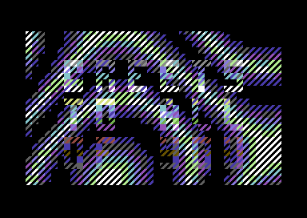

# makeshift

Source code for Makeshift by Logicoma, a 4 kilobyte demo for the Commodore 64

](final/screenshot.png)

## description

This is the source code for our 4 kilobyte demo, Makeshift, released at Solskogen 2017 for the Commodore 64. This is a direct copy of the project directory from our internal repo - none of it has been edited or modified. As such, there are some quirks to how things are built and some things are kindof messy/broken. I have no intention of fixing this; this is meant to be a snapshot of the exact data we worked with while making the intro, shared publicly because why not.

For more information, you can check out [the recording of my breakdown stream](https://www.youtube.com/watch?v=whuyeyPsQQ0), and the note file on the disk. It's recommended the note be read on a real C64 or at least in an emulator, for maximum vibes and pleasure. :)

Enjoy!

## license

This code is licensed under the MIT license (see LICENSE) with the exception of the `music.asm` file, which is distributed as-is.
